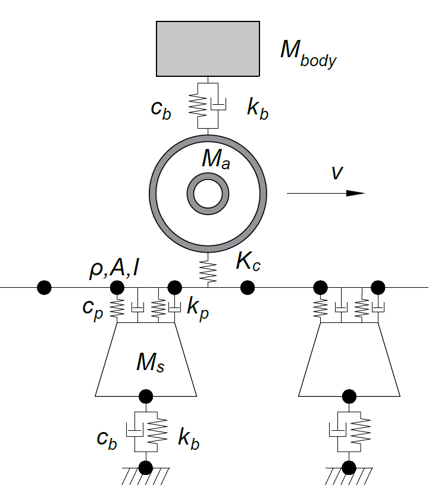

# railFE: Simplified Vehicle Track Interaction Model
Dynamic simulation of a simplified rail vehicle rolling on a railway track. The track is modelled as a timoshenko beam rail on discrete sleeper supports. The rail vehicle is modelled as a quarter car model.

## Table of Contents

- [Background](#background)
- [Install](#install)
- [Usage](#usage)
	- [Generator](#generator)
- [Related Efforts](#related-efforts)
- [Maintainers](#maintainers)
- [Contributing](#contributing)
- [License](#license)

## Background

## Model Description

The model is composed of several substructure components:
- Vehicle assembly (i.e. from Simpack),
- Track assembly (2D FE Model of Beam: 4DOF Timoshenko elements),
- Non-linear Hertzian contact spring:  
$$f_c = \left\{\begin{matrix}
		K_H\delta^{1.5},\; \delta>0 \\ 
		0,\; \delta\leq0 \\
		\end{matrix}\right.$$

## System Equations and State Space representation:
The equilibrium matrices of the system are formulated as: 
$$M_{sys}\ddot{q}_{sys}+C_{sys}\dot{q}_{sys}+[K_{sys}-K_c\delta^{0.5}E]q_{sys}=f_{irr}+f_{ext}$$
Local dynamics, modal superposition:
$$\ddot{\eta}_i+2\zeta_i\omega_i\dot{\eta}_i+\omega_i^2\eta_i+M_{cross}\ddot{q}_{tr}=f_i$$

## Install

## Usage

## Maintainers

[@CyprienHoelzl](https://github.com/CyprienHoelzl/).

## Contributing

Feel free to dive in! [Open an issue](https://github.com/CyprienHoelzl/railFE/issues/new) or submit PRs.

### Contributors

This project exists thanks to all the people who contribute. 

## License

[MIT](LICENSE) © Cyprien Hoelzl