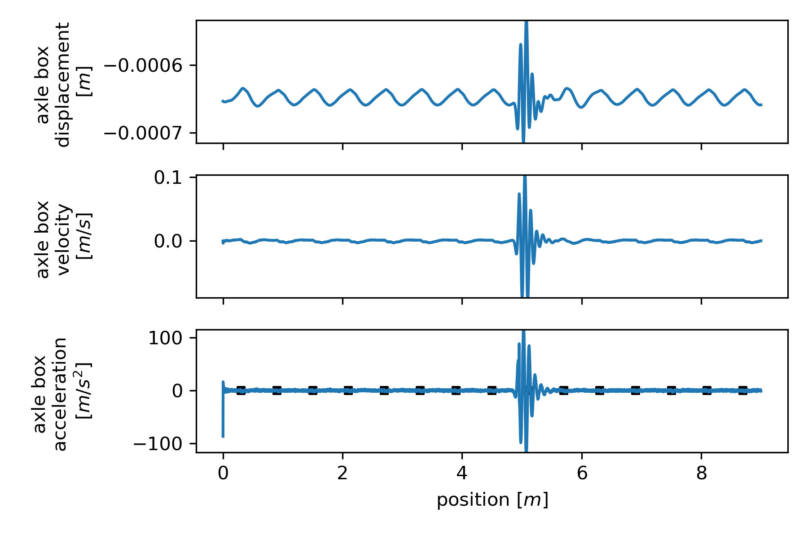

.. _timeintegration_impulse:
Time integration for impulse
========================================

This example evaluates the response of the axle during the crossing of a vehicle with the parameters of an EW4 Panorama waggon using the `github example code <https://github.com/CyprienHoelzl/railFE/blob/main/examples/timeintegration_default_track_impulse.py>`_.

Time series of the axle response for the crossing of a defect after 0.25 seconds:

Time series of the bogie response for the crossing of a defect after 0.25 seconds:

Time series of the body response for the crossing of a defect after 0.25 seconds:

Frequency response observed at different DOFs of the track for point excitation at mid-span or over the sleeper compared for PT (TIM4) and EB (TIM4eb):

