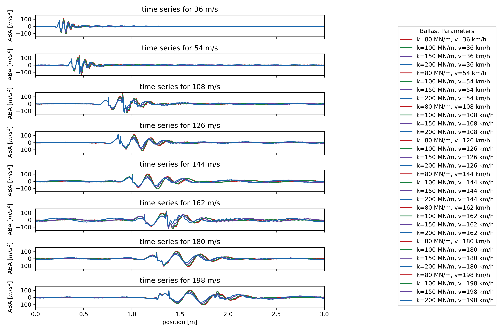

.. _timeintegration_varying:

Time integration with varying track parameters
=========================================================

This example evaluates the response of the system during the crossing of a vehicle with the parameters of an EW4 Panorama waggon using the `github example code <https://github.com/CyprienHoelzl/railFE/blob/main/examples/timeintegration_default_track_impulse.py>`_.

Time series of the axle response for the crossing of a defect after 0.25 seconds at varying speeds:

