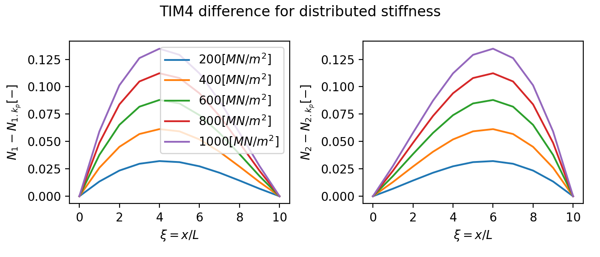
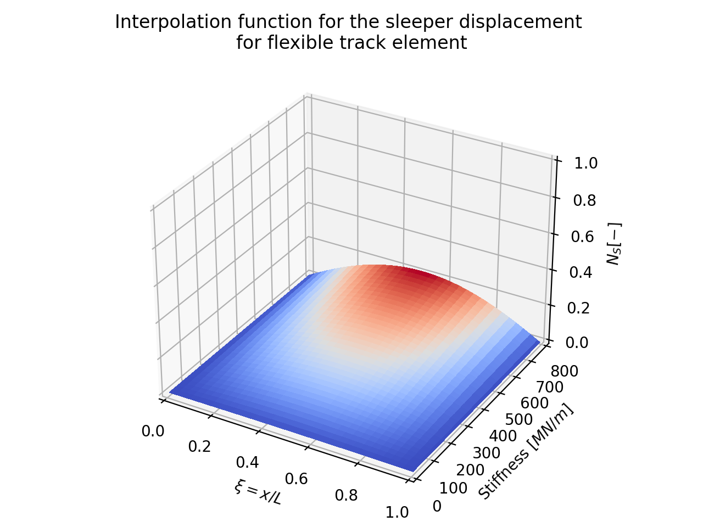

.. _shapefunctions:

4 DOF Timoshenko element shape functions
========================================

Plotting the shape function of 4 DOF Timoshenko elements using the `github example code <https://github.com/CyprienHoelzl/railFE/blob/main/examples/timoshenkoBeamElements_plotting.py>`_.

The track model implemented here is based on the work of Gimenez et al [Gimenez2018]_. 
The finite element implementations feature two choices of Timoshenko beam elements:

- The conventional 4 DOF Timoshenko (TIM4) element.
- A 4+1 DOF Timoshenko (TIM4eb) element which is supported by an elastic foundation distributed along the whole length of the element. 

The modified 4+1 DOF Timoshenko element (TIM4eb) has a 5th DOF which corresponds to the contribution from the vertical displacement of the sleeper.

The nodal displacement vector for a TIM 4 element composed of a beam with node 1 and 2 is:

.. math:: 

      u^{(e)}=\left\{ w_1,\theta_1,w_2,\theta_2\right\}

where :math:`w` is the vertical displacement and :math:`\theta` is the nodal bending rotation.

The following figure illustrates the interpolation functions for the response quantities of a standard TIM4 element:

.. image:: ../../figs/timoshenkoBeamElements/shapeFunctions_Timoshenko4.png
   :target: TIM4 Shapefunction comparison for punctual sleeper support

The interpolation functions for the response quantities of a TIM4 element on the elastic ballast is illustrated as:

The difference between the TIM4 and TIM4eb at changing stiffness can be illustrated as:

Influence of the sleeper stiffness on the interpolation function for the sleeper displacement:

