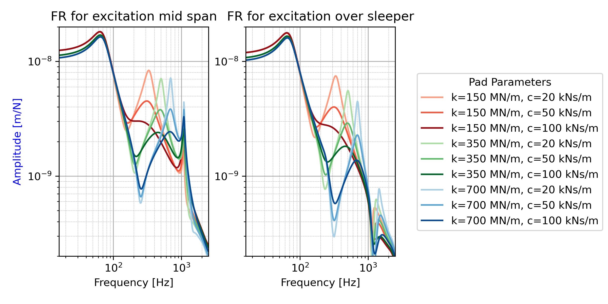

.. _track_freqresponse:

Track Frequency Response Evaluation
========================================

This example evaluates the frequency response of a track composed of TIM4 or TIM4eb (eb: elastic bedding) elements using the `github example code <https://github.com/CyprienHoelzl/railFE/blob/main/examples/TrackFrequencyResponseEvaluation.py>`_.

Frequency response of the track for point excitation at mid-span or over the sleeper for changing ballast pameters:

Frequency response of the track for point excitation at mid-span or over the sleeper for changing pad pameters:

Frequency response observed at different DOFs of the track for point excitation at mid-span or over the sleeper compared for PT (TIM4) and EB (TIM4eb):

Frequency response observed at different DOFs of the track for point excitation at mid-span or over the sleeper compared for PT (TIM4) and EB (TIM4eb):

Modal response amplitude and shapes for mid-span excitation at peak response frequencies (peak picking on the FRF):

Modal response amplitude and shapes for excitation over the sleeper at peak response frequencies (peak picking on the FRF):

.. image:: ../../figs/trackFrequencyResponseEvaluation/mode_shapes_load_oversleeper.png
	:target: Mode shapes for load midspan

